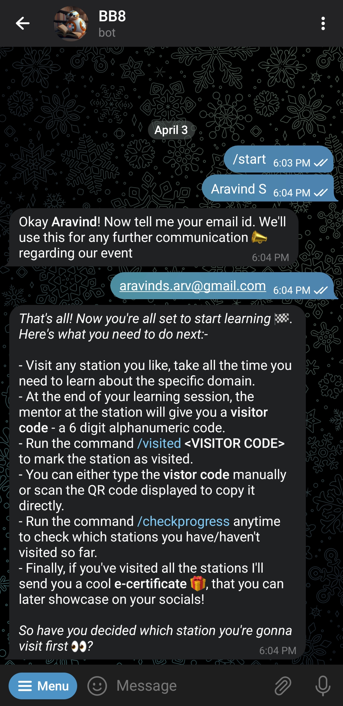

# BB8

<p align="center">
  
</p>

<p align="center">
  <i>The <b>Learning Stations</b> Bot</i>
  <br />
  <br />
  <b><a href="https://github.com/Tinkerhub-NSSCE/bb8/issues/new?assignees=&labels=feature&template=bug_report.md&title=">Report a Bug</a>
    ·
  <a href="https://github.com/Tinkerhub-NSSCE/bb8/issues/new?assignees=&labels=feature&template=feature_request.md&title=">Request feature</a>
</p></b>

<p align="center">
  <a href="https://pytba.readthedocs.io/en/latest/"></a>
  <a href="https://github.com/Tinkerhub-NSSCE/bb8/archive/refs/heads/main.zip"></a>
  <a href="#"></a>
</p>

**BB8** was designed to streamline the visitor tracking process for the **Learning Stations** hosted as part of our techfest **Dyuksha '23**. By automating the task of recording visitor information at various learning stations, BB8 helped us cut costs (for printing visitor cards, rubber stamps for each station etc.) and also improve the overall efficiency of the process.

## How it works
**BB8** has two possible user flows as shown in below diagram <br>
<p align="center">

</p>

- Once the bot starts running, it generates 6-digit randomized alphanumeric codes for each configured station every 5 minutes (this can be changed in the config file). These codes are also converted into scannable QR codes for ease of copying.
- Mentors can access the visitor codes for their respective stations using their mentor passcode (configurable). They can refresh the code using the `Refresh` button to display the current valid code to the visitors. 
- To mark a station as visited, visitors need to run the command `/visited <VISITOR_CODE>` after completing their learning session at a station. This updates their corresponding entry in the database to reflect their visit at that station.
- Visitors can also check which stations they have visited so far using the `/checkprogress` command.
- Once visitors have completed visiting all the stations, the bot automatically generates a _cool e-certificate_ for them and sends it!

## Commands
***General Commands***
- `/start` - Register as a Mentor/Learner
- `/visited` - Mark a station as visited. Usage: `/visited <visitor_code>`
- `/checkprogress` - See which stations you have visited and which are left. Also displays the name, participant id and email
- `/cleardata` - Clear your data from the database in case of any error in the name or email submitted

***Admin Only Commands***
- `/listcodes` - List the current valid visitor codes of all the stations
- `/getinfo` - Get the info of a participant. Usage: `/getinfo <participant_id>`
- `/regencert` - Regenerate the certificate for a pariticipant (in case someone has issues with their generated certificate, eg: wants to update their name). Usage: /regencert <participant_id>

## How to configure?
- Modify the `config.ini` file according to your requirements & preferences
- Copy `.env.sample` to a new file `.env` and replace the placeholder with your bot token. To learn how to generate a new bot token [read this](https://www.freecodecamp.org/news/how-to-create-a-telegram-bot-using-python/). Just remember to **turn off the permission to add the bot to groups**
- Create a new airtable base and a table with the following fields

| Field Name | Field Type |
| --- |--- |
| name | Single Line Text |
| primary_key | Autonumber |
| type | Single Line Text |
| tu_id | Single Line Text |
| email | Email |
| visited | Single Line Text |
| visited_num | Number |

- Then replace the `api_key`, `base_id` and `table_name` in the `config.ini` file with your own corresponding values
- Install all the requirements
```bash
$ pip install -r requirements.txt
```
- Run the bot
```bash
$ python main.py
```

## Screenshots
<p align="center">
  
  
  
  
  
  
</p>

## What's under the hood?
You can find all the required dependencies in the `requirements.txt` file. However here's an overview of the major libraries/tools we've used to create **BB8**
- [pyTelegramBotAPI](https://pytba.readthedocs.io/en/latest/)
- [schedule](https://schedule.readthedocs.io/en/stable/)
- [pyairtable](https://pyairtable.readthedocs.io/en/latest/)
- [qrcode](https://pypi.org/project/qrcode/)
- [pillow](https://pillow.readthedocs.io/en/stable/)

## Contributing
Do you have any thoughts on improving the bot? Ideas, design changes, code cleaning or even major codebase revamps, any and all such contributions are always welcome. BB8 just keeps getting better with each contribution, no matter how big or small 💪. If you'd like to get involved, you can start with the issues listed in our [issue tracker](https://github.com/Tinkerhub-NSSCE/bb8/issues) or you can create your own issue [here](https://github.com/Tinkerhub-NSSCE/bb8/issues/new/choose). <br>

